### 区块链基本概念

##### 区块链的本质

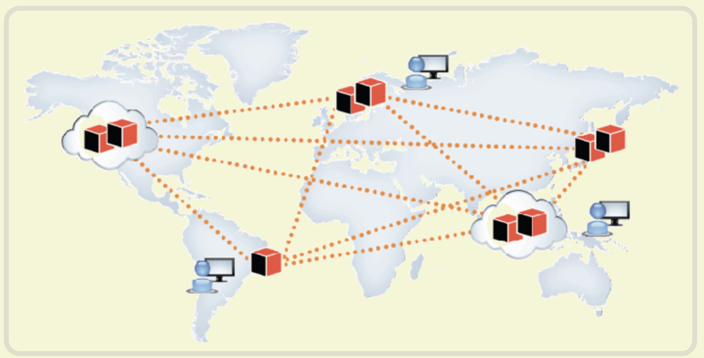

区块链是什么？一句话，它是一种特殊的分布式数据库。

为什么说区块链是数据库呢？**区块链的主要作用是存储信息。任何需要保存的信息，都可以写入区块链，也可以从里面读取，所以说是数据库**。

##### 

##### 区块链基本概念

[查看](https://anders.com/blockchain/hash.html) 

- 哈希hash：所谓“哈希”就是计算机可以对任意内容，计算出⼀一个⻓长度相同的特征值。区块链的 哈希⻓长度是256 位，这就是说，不不管原始内容是什什么，最后都会计算出⼀一个256位的⼆二机制数字。只要原始内容不不 同，对应的哈希⼀一定是不不同的。 1.**每个区块的哈希都是不不⼀一样的，可以通过哈希标识区块 。**2.**如果区块的内容变了了，它的哈希⼀一定会改变** 。
- 区块说明 

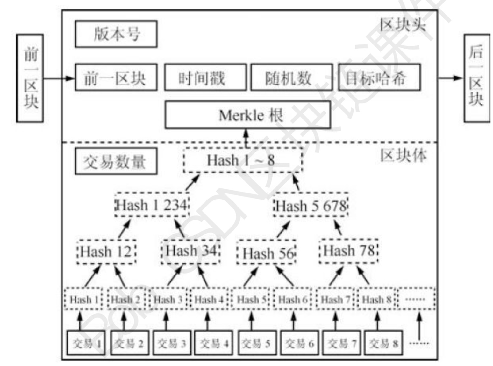

- 

##### 区块链核心概念

区块链（BlockChain），是区块（Block）和链（Chain）的直译，其数据结构如图 1 所示，即每个区块保存规定时间段内的数据记录，并通过密码学的方式，构建一条安全可信的链条，形成一个不可篡改、全员共有的分布式账本。

比特币的区块分为区块头和区块体两部分。区块头的大小为 80 字节，包括 4 字节的版本号、32 字节（256 位）的上一区块哈希值、32 字节的 Merkle 根节点、4 字节的时间戳、4 字节的难度值和 4 字节的随机数。区块体包含 10 分钟内选定的交易记录，第一笔交易（coinbase 交易）是用于奖励矿工比特币的特殊交易，由矿工自己添加进区块。

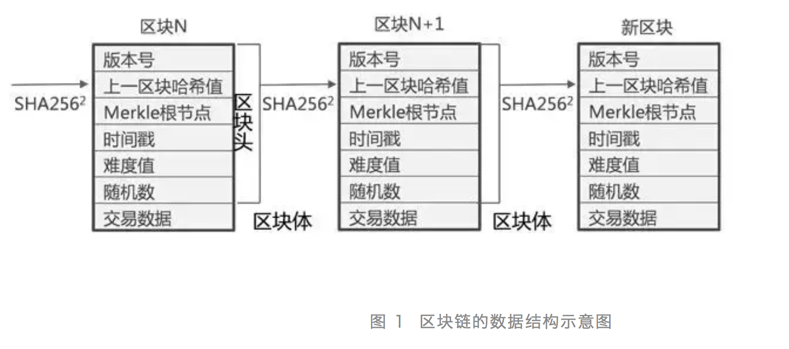

区块链是很多现有技术交叉融合在一起的集成创新。因此，要了解区块链，首先要了解区块链到底集成了哪些技术。

##### P2P网络

P2P（Peer-to-Peer）网络是一种端到端的网络。整个网络没有中心化的硬件或管理机构，**任一节点既是服务端，也是客户端**。任何节点只要安装相应的客户端软件，就能接入 P2P 网络（例如 BT 软件），参与区块链的记录和验证，不超过 1/3 节点的损坏、退出甚至被植入恶意代码，都不会影响整个系统的运作。

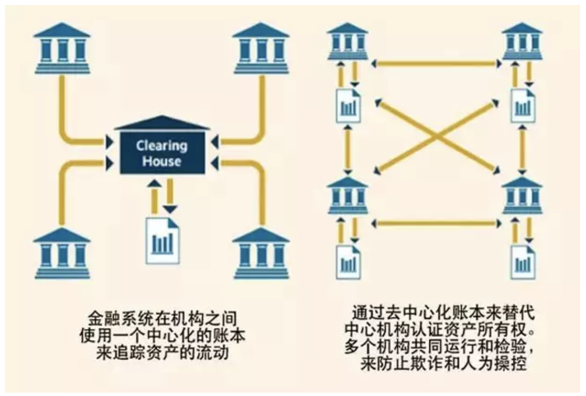

​                                         图 2  传统中心化系统和 P2P 网络的拓扑对比图

##### 加密算法和数字签名

加密技术分为对称、非对称和哈希（Hash）加密。对称加密是指用同样的密钥来进行加密和解密，非对称加密是指用一个密钥对来进行加密和解密，哈希加密主要是通过对数据进行哈希运算，用固定的哈希结果值验证信息是否被篡改。

- 非对称加密

在非对称加密技术中，对外公开、分发出去的密钥叫做公钥，不能公开、自己留存的密钥叫做私钥。公钥加密的，对应的私钥才能解密。反之亦然。如图 3 所示。

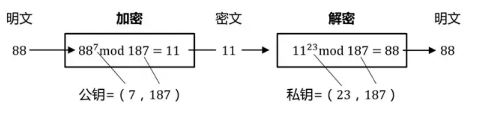

- 数字签名

基于数字签名的通信机制工作原理，如图 4 所示，发送报文时，发送方用一个哈希函数从报文文本中生成文件摘要，然后用自己的私钥对摘要进行加密，加密后的摘要将作为报文的数字签名和报文一起发送给接收方。接收方首先用与发送方一样的哈希函数从接收到的原始报文中计算出报文摘要，接着再用发送方的公钥来对报文附加的数字签名进行解密，如果得到的明文相同，那么接收方就能确认传输的文件并未受到篡改，是安全可信的。

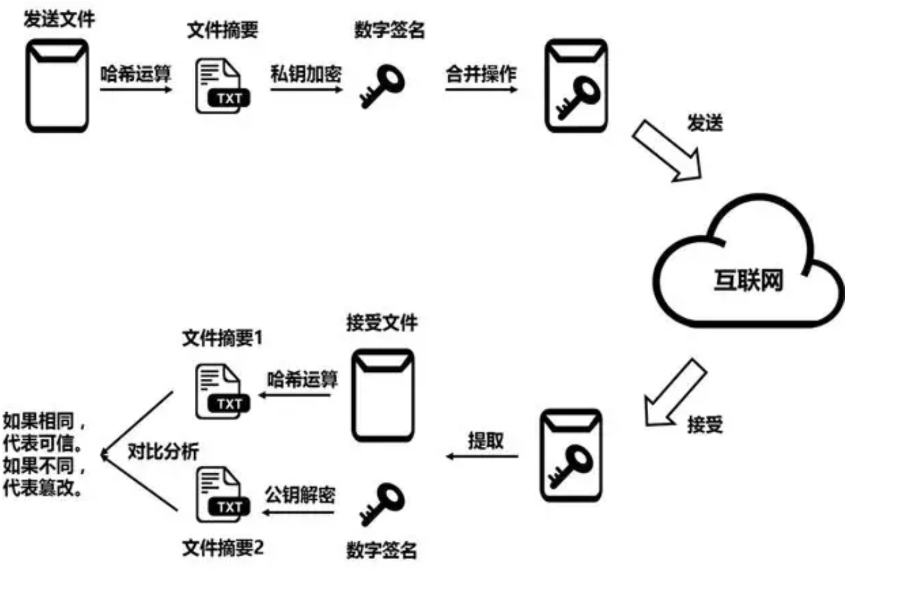

​                                                数字签名流程示意图

- 哈希算法

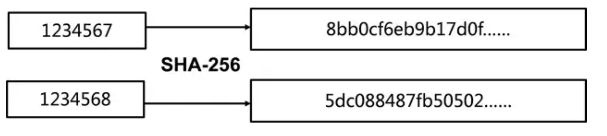

- 梅克尔树

梅克尔（Merkle）树是区块链的基本组成部分。如果没有梅克尔树，区块链也是可以运转，但是要在区块头里包含所有交易记录，扩展性方面存在很大挑战。如图 6 所示，区块链中的每个区块，由区块头和区块体构成，区块头中含有一个 Merkle 根节点的字段，通过对区块体中所有交易记录，以二叉树的形式迭代地两两拼接 、进行哈希操作，可以得到一个最终的哈希值，我们称之为 Merkle 根哈希。Merkle 根哈希相当于是对区块中所有交易记录进行了一个快照，区块中交易记录的任意改动都可以通过比较 Merkle 根哈希而很容易地察觉。Merkle 根哈希主要用于简单支付验证（SPV），在验证某个交易是否在区块中时，也能极大地减少网络传输成本。

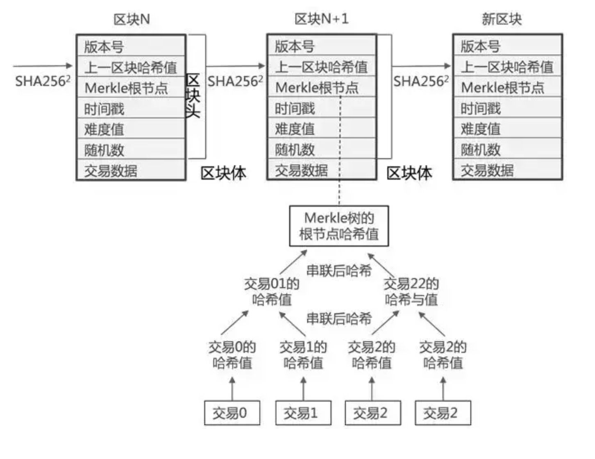

- 工作量证明机制

工作量证明机制，简单地说，就是一种共识机制，用来确认你是否做过一定量工作的证明。比特币的区块链主要是依托计算数学难题来衡量工作量。每个区块，当选定一定数量的交易记录之后，填充版本号、时间戳、难度值，生成相应的 Merkle 根哈希。很容易看到，这些数值在选定交易记录以后，都是确定的，唯一能够改变的就只有随机数（Nonce）这个值。如图 7 所示，系统根据难度值，要求计算整个区块头的两次 SHA256 算法，得到的哈希结果要小于一个阈值。根据前面描述的 SHA256 算法的伪随机性，只有通过不断地尝试和枚举，才能找到相应的随机数，证明自己的工作量。

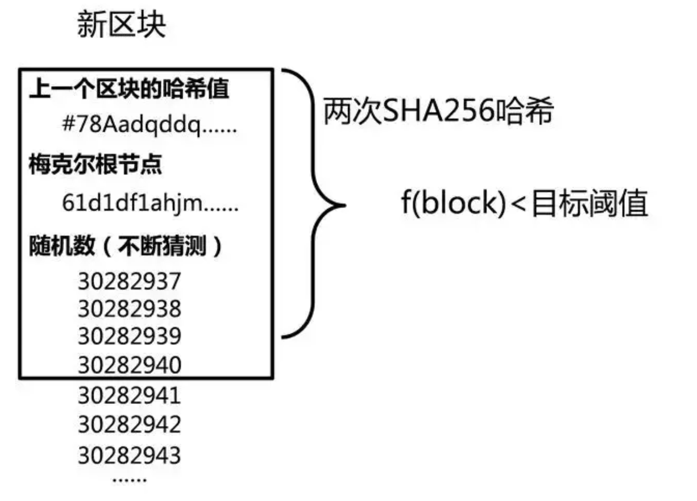

##### 区块链运转机制

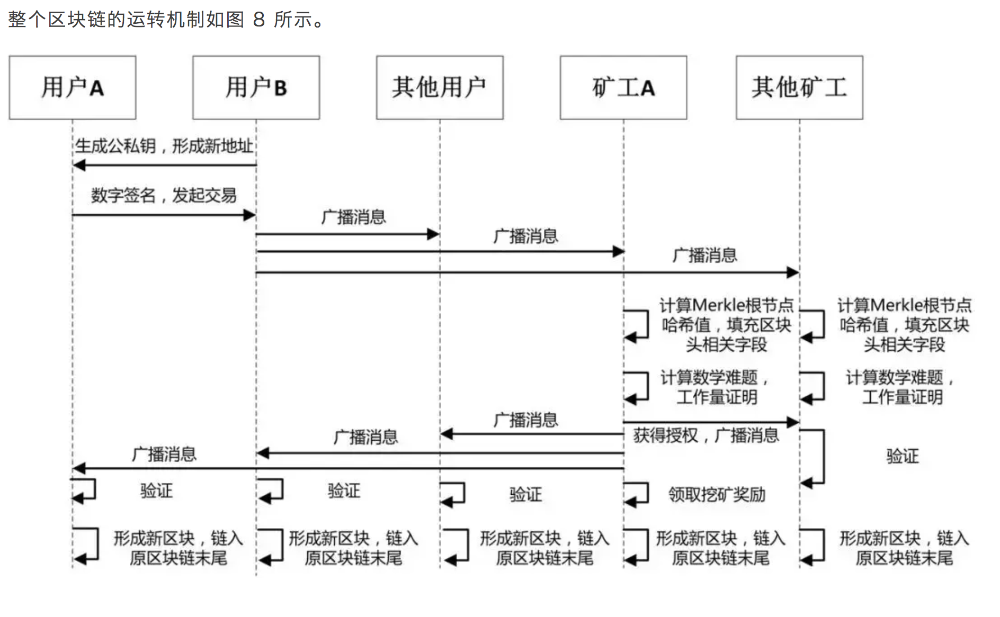

- 系统吞吐量(TPS)

TPS (transaction per second)代表每秒执行的事务数量，可基于测试周期内完成的事务数量计算得出。

 **QPS（TPS）：**每秒钟request/事务 数量

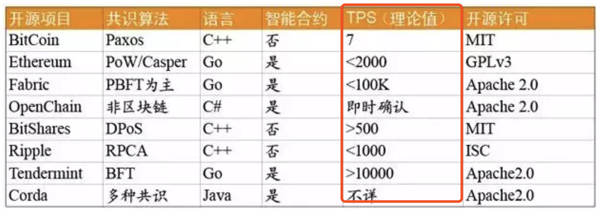

#### 经典账户模型分析

[参考链接](https://blog.csdn.net/desow/article/details/79529761)

比特币和以太坊在实现余额的处理上，采用了不同的机制，**比特币采用了UTXO**未花费交易输出；而以**太坊采用了维护账户状态**机制。

在**比特币中，其实并没有所谓的账户，只有比特币地址**。正确的表述一个比特币地址里面的余额，应该是这样的：**小明的比特币地址里面拥有价值20个比特币的UTXO**(下面讲何为UTXO)。

在以太坊中，是**拥有账户的概念**的，每个地址对应一个以太坊的账户，而表述以太坊账户的余额，就是传统的表述方式：**小明的以太坊账户里面拥有20个以太坊**。

- 比特币UTXO模型

比如你是一个卖冰峰的商家，小明有10元钱，想要购买一瓶冰峰，冰峰4元，小明支付给你10元钱，你需要给小明找回6元钱。也就是说，其实我们把10元钱分成了两份，一份是4元给商家的，一份是6元找零给小明的。

备注：在比特币中，每一笔UTXO都不可分割，必须在一次交易中，通过设置不同的输出将其拆分给不同的地址。

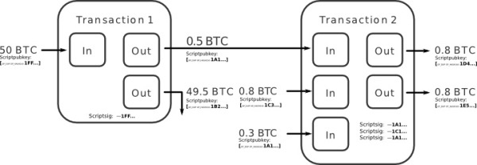

-  以太坊的账户模型

在以太坊中，其实账号模型是比较好理解的，因为以太坊的账户模型跟我们传统所理解的账户模型是一致的。在以太坊中，账户地址有两种，分别是：

外部账户地址：普通用户拥有的公私钥配对的账户，也就是我们常用的存储自己代币的账户地址。 合约账户地址：合约账户地址指智能合约的账户地址。

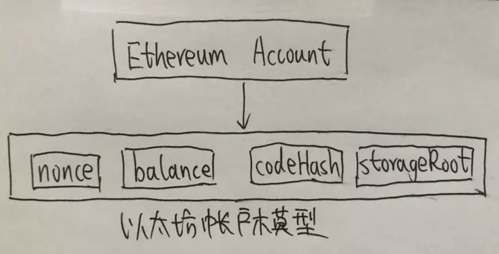

#### UTXO优点

- 私密性比较强，理论上可以为每一笔输出设置一个地址。
- 无需维护余额等状态值。
- UTXO是独立数据记录，可以通过并行极大的提升区块链交易验证速度。
- 无需关心事务问题，只需要关心输出脚本即可。
- UTXO无法分割，每次交易都需要多个输出，分别为支出与找零。

#### 账户模型优点

- 可以快速获取账户的余额，而比特币需要将指定地址所拥有的所有UTXO中的未花费交易总值整合。
- 节省空间，因为每笔交易只有一个输入一个输出。
- 可以较容易的实现图灵完备的智能合约。

